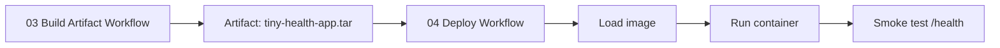

# Simulated Deployment

## Purpose

This file explains what "deployment" means in this course.

We will keep deployment simple and focused on the CI/CD story.

## When to Use This Page

Read this page right before the related Day 2 lab.

Use it to understand the concept first, then open the workflow lab.

## What We Mean by Deployment Here

In many teams, deployment means sending an application to a real server or cloud platform.

In this course, we will simulate deployment inside GitHub Actions.

That means:

- we use the built artifact
- we load the image
- we run the application
- we check that it responds correctly

## Why We Use Simulated Deployment

We use simulated deployment because the goal of this course is to understand the delivery flow, not cloud setup.

This helps us stay focused on:

1. verify the code
2. package the application
3. deliver the exact package
4. confirm the deployed app responds

## What the Deploy Workflow Does

The deploy workflow:

1. waits for the build workflow to finish successfully
2. downloads the saved build artifact
3. loads the Docker image from that artifact
4. runs the application as a container
5. checks `/health`

## Why This Workflow Starts Automatically

The deploy workflow uses `workflow_run` because deployment should happen only after the build workflow succeeds.

That keeps the story clean:

1. build the package first
2. carry that package forward
3. deliver it only after the build is ready

## Why This Matters

This is the final step in the course story.

We are no longer just saying:

"The code looked fine."

We are now saying:

"The packaged application was delivered and checked."

## The Main Idea to Remember

The most important sentence in this phase is:

We want to deliver the same package that we already built and verified.

## What You Do Not Need to Worry About

For this course, you do not need to learn:

- cloud deployment services
- networking details
- container orchestration
- advanced Docker commands

The simple delivery story is enough.

## Related Next Steps

- [LAB-03: Build Artifact Workflow](../labs/LAB-03-build-artifact-workflow.md)
- [LAB-04: Deploy Workflow](../labs/LAB-04-deploy-workflow.md)
- [Final Assessment Support](assessment/README.md)
- [Troubleshooting](help/02-troubleshooting.md)
