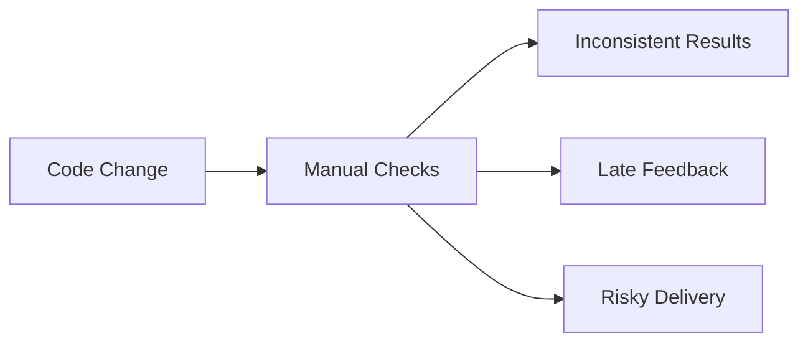
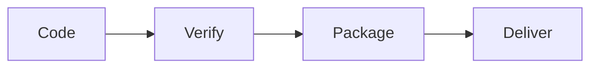
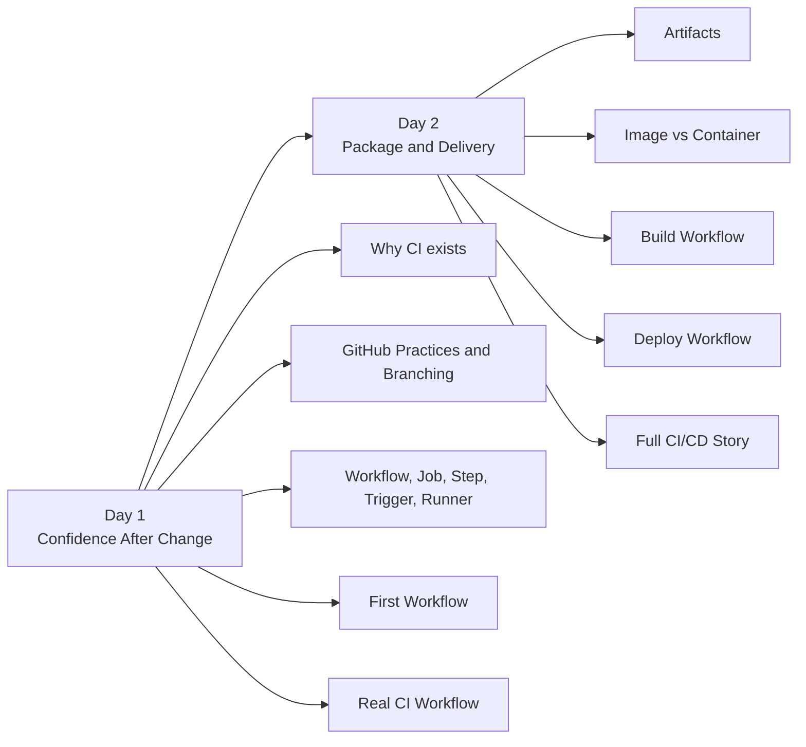
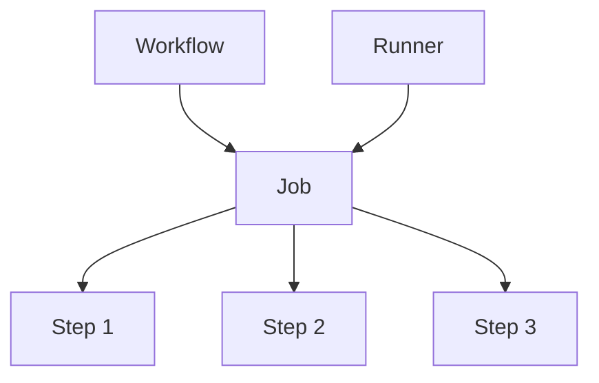
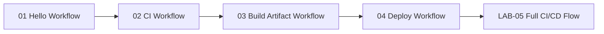
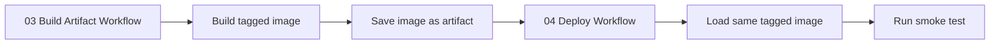
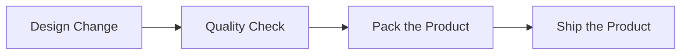
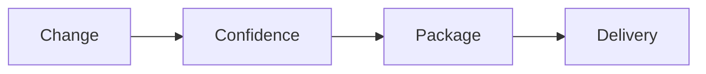

# Course Story with Diagrams

## Purpose

This page tells the course story in a visual way.

Use it at the beginning of the course, during the recap, or whenever you want to reconnect the ideas.

## The Big Idea

This course is not mainly about GitHub Actions syntax.

It is about learning one delivery story:

1. code
2. verify
3. package
4. deliver

## The Real-World Problem

Without CI/CD, teams often face problems like these:

- code works on one laptop but not another
- checks are skipped when time is short
- packaging is done differently each time
- deployment depends on memory
- problems are discovered too late

CI/CD exists to reduce those problems.

## The Main Course Story

Use this short explanation:

- code = we make or update the software
- verify = we check whether the change is still safe
- package = we create the output we want to carry forward
- deliver = we use that same package in the next step

## How the Two Days Connect

Day 1 answers:

`How do we know a change is still safe?`

Day 1 also builds the language needed for the labs:

- GitHub standard practices and a simple branching strategy
- workflow structure and trigger choices
- jobs, steps, actions, and environment variables
- where `matrix`, `needs`, and `secrets` fit as later exercise or next-step ideas

Day 2 answers:

`What do we deliver after the code is verified?`

## How GitHub Actions Fits the Story

GitHub Actions is the tool we use to express the process.

Use this short mental model:

- workflow = the full automation plan
- job = one group of work
- step = one action inside the job
- runner = the machine doing the work

## The Workflow Story in This Course

Each workflow adds one idea:

- `01 Hello Workflow` shows the shape of a workflow run
- `02 CI Workflow` shows automated verification
- `03 Build Artifact Workflow` shows packaging and artifact creation
- `04 Deploy Workflow` shows delivery using the saved package
- `LAB-05` connects the full story end to end

## How the Built Package Moves Forward

This is the Day 2 promise:

- build creates the package
- the package is saved
- deploy uses that same package

## Factory and Shipping Analogy

If the course feels abstract, use this analogy:

For this course:

- code = the design change
- verify = the quality check
- package = preparing the product for shipment
- deliver = shipping and using that prepared product

Important note:

The analogy helps explain the flow.

The real course terms still matter:

- workflow
- job
- step
- runner
- artifact
- image
- container

## What Success Looks Like

By the end of the course, students should be able to explain:

- why CI exists
- why verification and packaging are different
- why deployment should use the saved package
- how the full story connects from change to delivery

## Short Version to Remember

If you forget everything else, remember this:

Or even shorter:

`code -> verify -> package -> deliver`

## Related Pages

- [Course Map](../00-course-map.md)
- [Our Tiny Example App](../01-our-tiny-example-app.md)
- [Final Recap](../04-final-recap.md)
