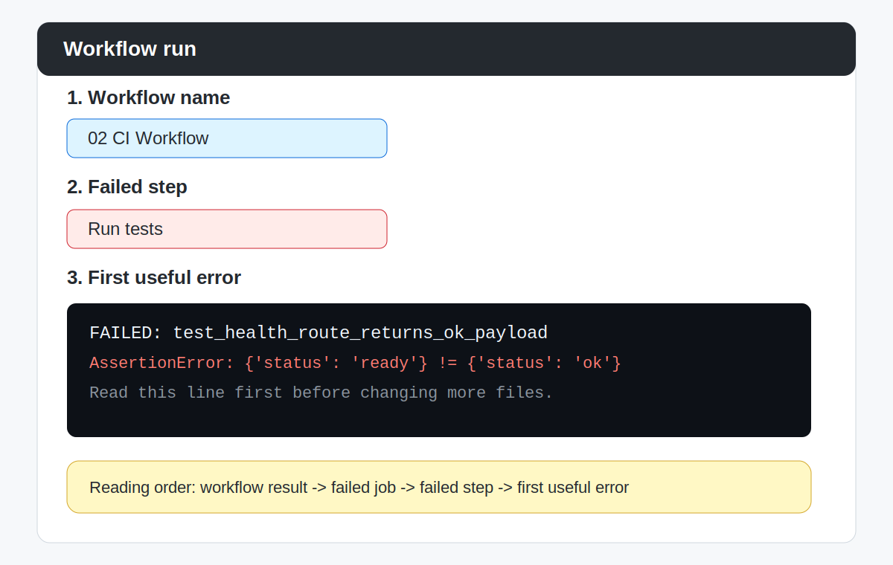

# How to Read Actions Logs

## Purpose

When a workflow runs, GitHub Actions shows what happened step by step.

This file shows the simplest way to read those logs without getting overwhelmed.

If you are confused about where the steps are running, also use [Runner Mental Model](00-runner-mental-model.md).

If you already know which part failed and want a recovery checklist, go to [Troubleshooting](02-troubleshooting.md).

## Start at the Workflow Run Page

Open the `Actions` tab.

Then open one workflow run.

On the run page, first look for these four things:

- workflow name
- job name
- step names
- final result

Do this before reading the detailed logs.

## Read from Outside to Inside

Use this order:

1. Did the workflow pass or fail?
2. Which job passed or failed?
3. Which step passed or failed?
4. What message appears inside that step log?

This order helps you stay calm and focused.

## What Green and Red Mean

- green usually means the step passed
- red usually means the step failed

A red result does not mean you ruined anything.

It means the automation found a problem early, which is one of the main goals of CI.

## For the CI Workflow, Look for These Steps

In `02 CI Workflow`, you should see steps like:

- `Check out repository`
- `Set up Python`
- `Run tests`

If the workflow passes, the `Run tests` step should show the test results.

## Where to Look First When Something Fails

If a workflow fails:

1. open the failed job
2. open the failed step
3. read the first clear error message
4. look at the command that was running

Do not change many files at once before you understand the failure.

## Example of a Failed Step

Use this reference view:

Notice these three things:

- workflow name
- failed step
- first useful error

## Example Questions to Ask Yourself

When reading logs, ask:

- Did the workflow start at all?
- Did the repository get checked out?
- Did Python get set up?
- Did the tests run?
- Which exact step turned red?

## Common Beginner Mistake

Many beginners open the workflow page and immediately scroll through everything.

A better approach is:

- identify the failed step first
- then read only that step carefully

## Good Mindset

When a workflow fails, say:

"What is the first useful clue here?"

That question is usually more helpful than:

"Why is everything broken?"

## Related Help

- [Runner Mental Model](00-runner-mental-model.md)
- [Troubleshooting](02-troubleshooting.md)
- [Glossary](03-glossary.md)
