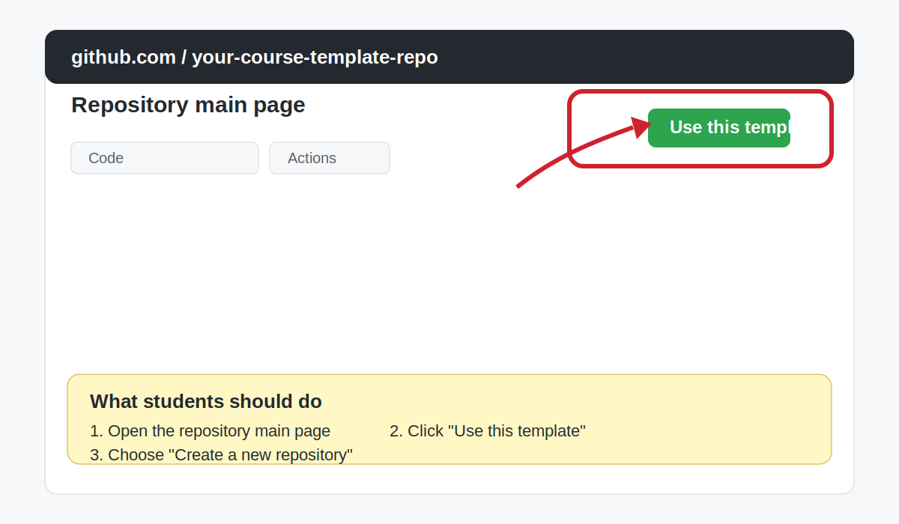

# Create Your Course Repository from the Template

## Purpose

In this course, you should create your own repository from the public course template.

This is better than editing the instructor's repository directly.

It gives you:

- your own copy
- your own workflow runs
- your own commit history
- a safer place to experiment

## Before You Start

Make sure:

- you can sign in to GitHub
- your GitHub account is ready
- your instructor has shared the public course template repository link

## Step 1: Open the Public Course Template Repository

Your instructor will give you the template repository link.

In most classes, this link is shared in one of these places:

- the class chat
- the LMS or course page
- email
- a slide or QR code during class

Open that repository in your browser.

You should see the course files on the main page of the repository.

The link should look similar to:

`https://github.com/iabouemira95/gha-cicd-course-student`

Important:

- open the repository main page, not the `Settings` page
- make sure the repository is public
- make sure you can see the files before you continue

## Step 2: Click `Use this template`

Near the top of the repository page, click `Use this template`.

Then choose `Create a new repository`.

Those are the exact button labels most students should look for.

If you do not see that button, ask your instructor to confirm that the course repository is marked as a template repository.

## What the Template Button Looks Like

Use this reference view to match the page quickly:

## Step 3: Choose Your New Repository Settings

Use these beginner-friendly settings:

- Owner: your personal GitHub account
- Repository name: `gha-cicd-course-practice`
- Visibility: `Public`

You can keep the default branch name that GitHub creates.

## Step 4: Create the Repository

Click `Create repository`.

GitHub will generate a new repository under your account using the course template files.

This means:

- the new repository belongs to you, not to the instructor
- you start with the same files as the course template
- your workflow runs will happen in your own repository
- your later commits will be your own work

For this course, that is exactly what we want.

## Step 5: Confirm That the Repository Belongs to You

Check these items:

- the repository URL includes your GitHub username
- the repository name is the one you selected
- you can open the `Code` tab and see the files

## Step 6: Find the Actions Tab

At the top of the repository page, look for the `Actions` tab.

You may not see workflow runs yet, and that is okay.

For this course, it is important that you know where this tab is before we start workflows.

You may also see optional workflows later in the repository.

For the main course, you should still focus only on the workflows your instructor asks you to open.

## Common Problems

### I cannot find `Use this template`

Possible reasons:

- you are not on the correct repository page
- the instructor repository is not marked as a template
- the page has not fully loaded

Refresh the page once, then ask for help if the button is still missing.

### I created a fork instead of using the template

This is recoverable, but it is not the best path for this course.

Ask your instructor whether to keep going or create a fresh repository from the template.

### I cannot find the `Actions` tab

Look in the top row of repository tabs.

If your browser window is narrow, GitHub may place some tabs inside an overflow menu.

## Before You Continue

Continue only when all items below are true:

- I created a repository under my own account
- I know its URL
- I can open the `Code` tab
- I can find the `Actions` tab

## Reference

Official GitHub Docs:

- [Creating a template repository](https://docs.github.com/en/repositories/creating-and-managing-repositories/creating-a-template-repository)
- [Creating a repository from a template](https://docs.github.com/en/repositories/creating-and-managing-repositories/creating-a-repository-from-a-template)
- [Viewing workflow run history](https://docs.github.com/en/actions/how-tos/monitor-workflows/view-workflow-run-history)
