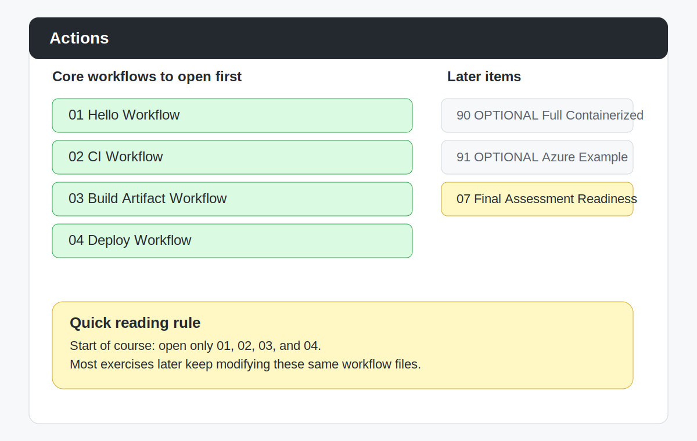

# Find the Actions Tab and Check Workflows

## Purpose

Before we start the first workflow lab, you should know where GitHub Actions lives in your repository.

You should also know what to do if GitHub asks you to enable workflows.

## Step 1: Open Your Repository

Open the repository you created from the course template.

Make sure the repository belongs to your own GitHub account.

## Step 2: Find the `Actions` Tab

At the top of the repository page, look for the `Actions` tab.

If you do not see it immediately:

- check the top row of tabs carefully
- widen your browser window
- look inside the overflow menu if GitHub is hiding some tabs

## Step 3: Open the Actions Page

Click `Actions`.

On this page, you should be able to see workflow information for your repository.

You may already see a workflow named `01 Hello Workflow`.

If you do not see any workflow runs yet, that is okay.

The first lab will create the first run.

You may also see later optional example workflows and one later final assessment prep workflow.

That is normal.

At the start, still focus only on the four core workflows.

## Open Only These Workflows at the Start

At the start of the course, open only these workflow names:

- `01 Hello Workflow`
- `02 CI Workflow`
- `03 Build Artifact Workflow`
- `04 Deploy Workflow`

## What the Actions Page Looks Like

Use this reference view to match the page quickly:

In this view:

- `01`, `02`, `03`, and `04` are the workflows to open first
- `05` and `06` are optional next-step examples
- `07` is the later final assessment prep workflow

The final assessment prep workflow is preloaded later in the course.

The final assessment workflow itself is not preloaded in the student repo.

You create that later yourself if your instructor uses the final assessment.

## Step 4: If GitHub Asks You to Enable Workflows

In many student repositories, GitHub Actions is already ready to use.

If GitHub shows a message asking you to enable workflows:

1. click the button to enable workflows
2. wait for the page to refresh
3. stay on the `Actions` page

## Step 5: Return to the Code

Go back to the `Code` tab.

Then open this file:

`.github/workflows/01-hello.yml`

That is the first workflow we will use in the course.

## Before You Continue

Continue only when all items below are true:

- I can open my repository
- I can find the `Actions` tab
- I can open the `Actions` page
- I can find `.github/workflows/01-hello.yml`

## Setup Self-Check

Before the first lab starts, you should be able to say:

- I am in my own repository
- I know where the `Actions` tab is
- I know where the first workflow file is
- I am ready to follow the lab one step at a time

## Common Problems

### I cannot find the `Actions` tab

Try these checks:

- confirm you are in your repository, not someone else's
- widen the browser window
- check for hidden tabs in the overflow menu

### I cannot find `.github/workflows/01-hello.yml`

Make sure you are looking in the repository file list on the `Code` tab.

If the file is still missing, ask your instructor to confirm you created your repository from the correct template.

## Reference

- [Managing GitHub Actions settings for a repository](https://docs.github.com/en/repositories/managing-your-repositorys-settings-and-features/enabling-features-for-your-repository/managing-github-actions-settings-for-a-repository)
- [Viewing workflow run history](https://docs.github.com/en/actions/how-tos/monitor-workflows/view-workflow-run-history)
